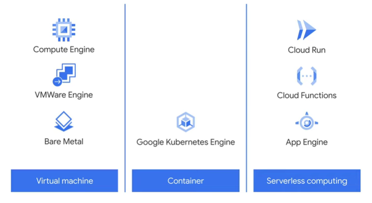

#### Infrastructure and Application Modernization with Google Cloud

Consumer expectations over the last 20 years have radically changed. Customers now expect connected digital experiences in real time. Many businesses, especially large traditional enterprises, built their IT infrastructure on premises. Legacy systems and applications make up the organization's IT backbone. At the same time, these legacy systems and applications struggle to achieve the scale and speed needed to meet modern customer expectations. Business leaders and IT decision-makers constantly have to choose between maintenance of legacy systems, and investing in innovative new products and services.   

In this course, I'll explore the challenges of an outdated IT infrastructure, and then describe how businesses can modernize that infrastructure using cloud technology.

In Module One, I'll introduce infrastructure modernization as the core topic, In particular, I'll examine compute options available in the cloud and the benefits of each. I'll also present a few Google cloud solutions and highlight customers who have successfully used them.

In Module Two, I'll focus on application modernization. Applications are not new in the cloud. But cloud technology enables businesses to develop, deploy, and update applications with speed, security and agility built it. I'll also cover App Engine, a Google Cloud solution that lets application developers build scalable web and mobile applications on a fully managed serverless platform.

In the third module, I'll present application programming interfaces, or APIs, and explain how they unlock value from legacy systems, enable businesses to create new value, and monetize new services. I'll also cover Apigee, a Google Cloud Platform for developing and managing APIs.

#### Module 1: Modernizing IT Infrastructure with Google Cloud

Nowadays scale is not a deciding factor for a business to grow but digital disruption is happening and economically managing IT infrastructure is possible.

Central to an organization's ability to thrive in the new era is how they structure and use its IT resources. This could mean moving away from investing resources to run and maintain existing IT infrastructure to focusing more on creating new higher-value products and services. 

With Cloud, organizations can develop and build new applications to drive better engagement with customers and employees faster, securely, and at scale. And ultimately, leveraging cloud technology to truly transform a business requires new collaborative models, changing culture and processes, and enabling team productivity and innovation. 

Enterprises are also seeing significant financial benefits from adopting Cloud as their approach to IT moves from buying fixed capacity to paying only for what they use, changing the economics of technology investment. For many businesses, infrastructure modernization is the foundation for digital transformation.

- Beginning by explaining what it means to modernize IT infrastructure and why it matters. Then the different computing options are available.
- Next, by covering private, hybrid, and multi-cloud architectures and what we mean by each of them. 
- Then, briefly go over Google Cloud's global infrastructure, and close with Google Cloud compute solutions for setting up or modernizing the IT infrastructure.

**Infrastructure Modernization:** We are going to understand infrastructure modernization by taking a simple example where a house owner is responsible for maintaining every single thing in a house from outer security to inner systems.  
A solution to this problem is "Outsourcing" your outer security so you have to focus on inner systems maintenance per changing needs, same happens in the case of moving toward managed service instead of on-premise service where the tedious task can be managed by another company like scaling and automating repeated task like node increase and should take care of developing features instead of maintaining infrastructure. It is also cost-effective, as it uses virtualization.

**Understanding compute options in the cloud:** The cloud is:

- On-Demand Self Service: It means the cloud provides network security, storage, compute power, and data to make application management easier by using managed service.
- Broad Network Access: It means that access to data and compute resources is no longer tied to a particular geography or location. Now teams can access compute resources and data with little to no latency.
- Resource Pooling: It means resources are distributed across a global network of data centers. If one is down due to a natural disaster, for instance, another data center is available to prevent service disruption.
- Rapid Elasticity: It means companies can scale up or down instantly due to the availability of on-demand cloud resources. This rapid elasticity means businesses can serve their customers without interruption in a cost-effective way.
- Measured Service: It means the cloud is a measured service, which means companies have a lower upfront or capital expenditure because they don't need to purchase their own data center equipment or maintain their IT infrastructure.

There are three main options that you can use to modernize your infrastructure are *virtual machines*, *containerization*, and *serverless computing*.

For containers and virtual machines, you can refer to this [blog by atlassian](https://www.atlassian.com/microservices/cloud-computing/containers-vs-vms).

The container need some maintenance and scaling as well this is where *kubernetes* comes into the picture for more details you can refer to this [blog by atlassian](https://www.atlassian.com/microservices/microservices-architecture/kubernetes-vs-docker).  

Most of time a organization uses mix of VMs and Containers in there application architecture as per the requirement.

*Serverless computing* doesn't mean there's no server though. Serverless computing means that resources such as computing power are automatically provisioned behind the scenes as needed. This means that businesses do not pay for computing power unless they're actually running a query or application. At its simplest, serverless means that businesses provide the code for whatever function they want, and the public cloud provider does everything else. For more reference, you can see this [blog by Bealdung](https://www.baeldung.com/cs/serverless-architecture)

**Hybrid and multi cloud:** Lets, start with standard definition of Private cloud, hybrid cloud, and multi-cloud.

- Private cloud is where an organization has virtualized servers in its own data centers to create its private on-premises environment. This might be done when an organization has already made significant investments in its infrastructure or if, for regulatory reasons, data needs to be kept on-premises. 
- Hybrid cloud is when an organization is using some combination of on-premises or private cloud infrastructure and public cloud services. This is the situation many organizations are currently in. Some of their data and applications have been migrated to the cloud. Others remain on-premises and interconnecting between the private and public clouds allows interoperability. 
- Multi cloud is where an organization is using multiple public cloud providers as part of its architecture. In this case, the organization needs flexibility and secure connectivity between the different networks involved. An organization might choose to use either hybrid cloud or multi-cloud if they want to incorporate specific elements of a public cloud in order to take advantage of the key strengths of that provider.

So, in the case of google it offers a vast network as it carries a major amount of internet traffic so using google cloud opens access to google's network, and google believes no cloud provider lock-in condition to deliver services an organization needs to deliver, and to deliver multi-cloud or hybrid network architecture google cloud uses rest apis or apis in general in there architecture as well.

**Google Cloud Compute Options:** Above we have learned how compute option used to modernize legacy infrastructure, google cloud offers range of solution firstly from *Compute-Engine, Google-Cloud-VMware-Engine, and Bare-Metal* secondly to *Google Kubernetes Engine, or GKE, which is a container-based compute option* and lastly to explore *three serverless computing solutions, App Engine, Cloud Functions, and Cloud Run*.  

    

1. *Virtual Machine:* 
    - Compute Engine, which is a computing and hosting service that lets you create and run virtual machines on Google's infrastructure. It delivers scalable, high performance virtual machines running in Google's innovative data centers and worldwide fiber network. 
        - Compute Engine VMs boot quickly, come with persistent disk storage, and deliver consistent performance. 
        - This solution is ideal if you need complete control over the virtual machine infrastructure. It's also useful if you need to run a software package that can't easily be containerized or have existing VM images to move to the cloud. 
    - Google Cloud VMware Engine is a fully managed service that lets you run the VMware platform in Google Cloud.
        - Google manages the infrastructure, networking, and management services, so that you can use the VMware platform efficiently and securely.
    - Bare Metal enables you to migrate specialized workloads to the cloud while maintaining your existing investments and architecture.
        - This allows you access to and integration with Google Cloud services with minimal latency. 
2. *Container:* 
    - Google Kubernetes Engine, or GKE, provides a managed environment for deploying, managing, and scaling your containerized applications using Google infrastructure.
        - The GKE environment consists of multiple machines, specifically Compute Engine instances, grouped together to form a cluster.
        - GKE allows you to securely speed up app development, streamline operations, and manage infrastructure.
3. *Serverless Computing:*
    - Cloud Run allows developers to build applications in their favorite programming language with their favorite dependencies and tools and deploy them in seconds.
        - Cloud Run abstracts away all infrastructure management by automatically scaling up and down from zero almost instantly depending on user traffic.
    - Cloud Functions is a serverless execution environment for building and connecting cloud services. It offers scalable, pay-as-you-go functions as a service to run your code with zero server management.
        - Cloud Functions offers a simple and intuitive developer experience.
        - Using Cloud Functions developers can simply write your code and let Google Cloud handle the operational infrastructure. With Cloud Functions, developers are also more agile as they can write and run small code snippets that respond to events.
    - App Engine a fully managed environment lets you focus on code while App Engine manages infrastructure concerns.

It is important to leveraging the right cloud option in your business can transform how you work and unlock new value.
#### Module 2: Modernizing Applications with Google Cloud

#### Module 3: The Value of APIs

