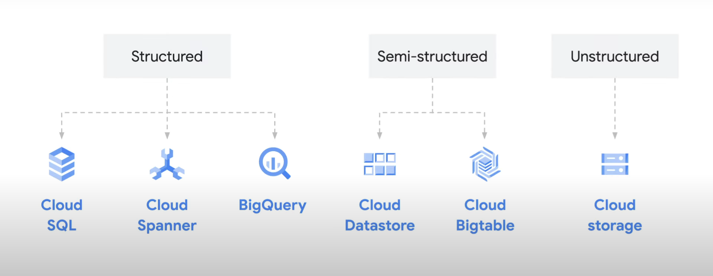
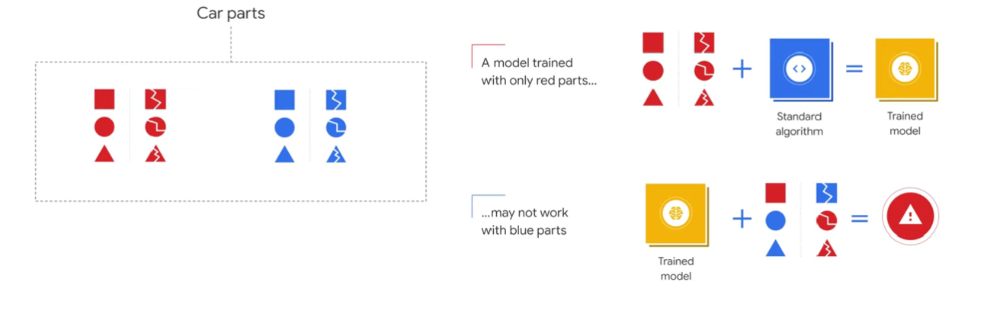
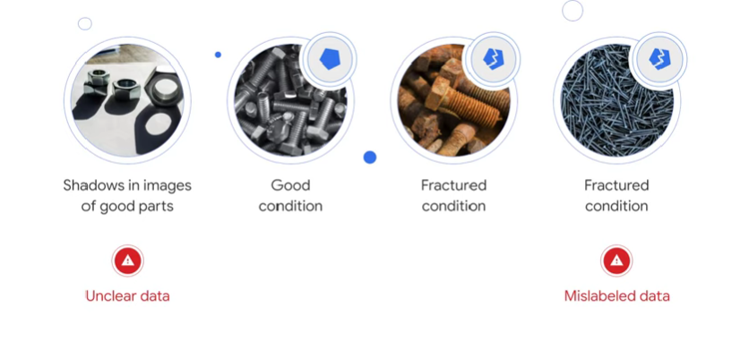
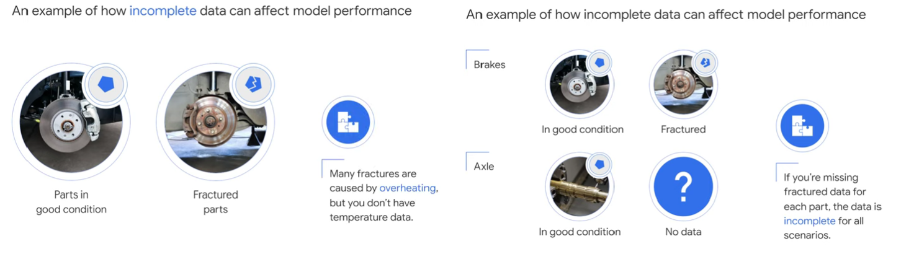
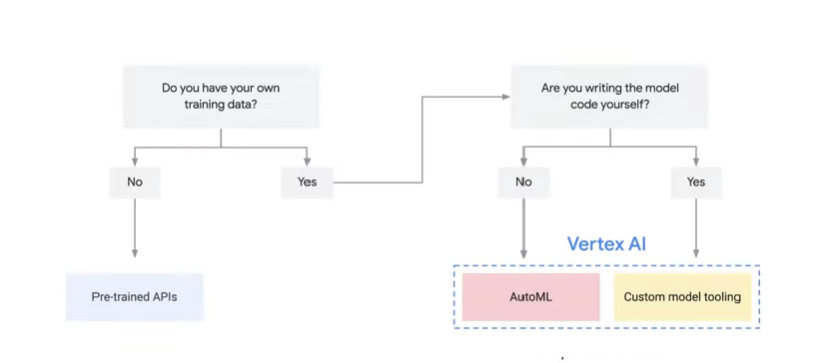
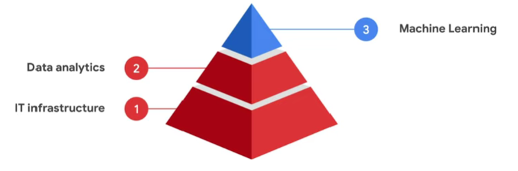

#### Innovating with Data and Google Cloud

Business data is not a new term. Businesses have leveraged information about performance and operations for centuries to make decisions. Traditionally, data analysis could take days or months, is often incomplete, and complex reports were often done by specialized teams. Cloud technology disrupts traditional data analysis. Data can now be consumed, analyzed, and used at speed and scale never before possible.

In fact, businesses can now leverage cloud technology to ingest data in real time to train machine learning models and to take action.  

In this course, we're going to explore how businesses can better use data in their digital transformation journey.

***In Module 1***, I'll define data and its role in digital transformation. I'll identify where you can find data and how you can create new insights by combining different datasets.

***In Module 2***, I'll examine the differences and similarities between databases, data warehouses, and data lakes. I'll offer use cases for each and some relevant Google Cloud solutions for getting the most value from your data.

***Finally, in Module 3***, I'll look at machine learning and artificial intelligence. I'll highlight key opportunities for applying ML in any business and cover common Google Cloud ML and AI solutions that you can start using right away. Throughout the course, what I want you to remember is you don't have to be a data scientist or technical expert to do data analysis or to use machine learning.

In fact, with the right cloud tools, data is now accessible in new ways. Anyone in your organization can unlock the value of data to enable digital transformation.

#### Module 1 (The Value of Data)

Businesses now have access to data like never before. This includes internal information, data from inside your organization, and external information, customer and industry data. For example, as organizations have digitized their operations, all kinds of business data has become available, such as financial information, logistics data, production output, and quality reports. Businesses also have access to new kinds of data about their customers. Consider digital interactions such as the length of time a user spends on a web page or reaction to a social media post. These are totally new and very rich sources of information about customer behavior. 
So for example, shopping mall previously we used camera check theft activity but now we can use those cameras to monitor expression towards the product are you inside a mall and optimise it to make better sales.
 
Above is an example of data collected for delivery company you should deliver food and even its applicable for the larger cargo delivery in terms of User data, Corporate data, Industrial data.

So, using User-Data and Industrial-Data *(mostly in Structure and Unstructured Data)* we can optimize what Corporate data being obtained and used/optimise digital transformation.

##### Type of data

- **Structured Data**: Structured data is highly organized. Examples include customer records consisting of names, addresses, credit card numbers, and other quantitative data. Structured data can be easily stored and managed in databases.
- **Semi-Structure Data**: Semi-structured data is data that does not conform to a data model but has some structure. It lacks a fixed or rigid schema. It is the data that does not reside in a rational database but that have some organizational properties that make it easier to analyze. With some processes, we can store them in the relational database. 
- **Unstructure Data**: Unstructured data has no organization and tends to be qualitative. Examples of unstructured data can include word processing documents, audio files, images, and videos. This data can be stored as objects. An object consists of the data itself, a variable amount of metadata, and a globally unique identifier. Some unstructured data can be stored in a format called a BLOB. This stands for Binary Large Object. Images, audio, and multimedia files can all be stored as BLOBs.

##### Important data considerations

Capturing, storing, and analyzing vast amount of data is key to adopting Cloud technology. But handling this volume and diversity of data comes with its own ethical considerations and requires alternative ways of thinking about security. Google believes that capturing and managing data demands responsibility and accountability. Not all information that can be captured should be captured. In other words, businesses are accountable for making responsible decisions about which data they collect, store, and analyze. This also extends the data that businesses already own. In this case, it's essential to examine who has access to the data and how they'll be using it.

First, consider the source of the data, how it's being collected, and where it's stored. If it's personal or sensitive data about a customer or an employee, it needs to be securely collected, encrypted when stored in the Cloud, and protected from external threats. Additionally, only a subset of users should be granted permission to view or access the private data. Data security and privacy becomes more complex in a global economy. Let me explain where this can be particularly important. Suppose, for instance, you want to use thousands of lung X-ray images to train an ML model to automatically identify tumor markings in new patient X-rays. What you need are the X-ray images. This is the relevant data. What's not relevant is patient's personal data. You need to ensure that any source data about individuals such as names or addresses is omitted or redacted. There's also some information that is not personally identifiable and should still not be included in the modeling for ethical reasons.

#### Module 2 (Data Consolidation and Analytics)

Businesses that leverage data effectively can improve efficiency and productivity, deliver fresh, personalized customer experiences, and create new business value and how you can combine them to generate insights and take intelligent action.

In particular, I discussed the different types of data that businesses can access, and how you can combine them to generate insights and take intelligent action. The way that data is collected, stored, and managed is foundational to what you can do with it. In this module, I'll start by considering where data is now and the benefits of migrating your data to the Cloud.  

When you store your data on-premises, you're responsible for the IT infrastructure that supports the collection, security, and processing of that data. You're also responsible for maintaining and expanding the capacity of your IT infrastructure. This can be expensive and time-consuming. It's also difficult to scale quickly. If you have limited storage space, then you risk missing opportunities to gain insights with new data.

You also risk downtime. Imagine that you launch a mobile app and don't accurately predict demand. A lot more people download and use it than you expect. Your infrastructure isn't set up to absorb that much data that fast. As a result, the app freezes or crashes, resulting in dissatisfied users. With Cloud, you can rent space from public Cloud providers like Google Cloud. This means that your data storage and compute powers are elastic. It can scale up or down as the data you take increases or decreases.

*These are many solutions for data storage:*

- *Cloud database or Database* : A database is an organized collection of data generally stored in tables and accessed electronically from a computer system. Companies typically use a database to keep track of their basic online transactions, provide information that will help the company run its business efficiently, or help managers and employees make better decisions. For example, a hotel booking site would use a database for their customer transactions.If a person books a room for a night, that data is captured in the database, and the room availability is updated in real time on all customer channels. Cloud SQL and Cloud Spanner are google cloud solution
    - *Cloud SQL*: Cloud SQL is a fully managed relational database service for MySQL, PostgreSQL, and SQL Server. This frees you from database administration tasks so that you have more time to manage your data. Cloud SQL provides a cloud-based alternative to local MySQL, PostgreSQL, and SQL Server databases. You should use Cloud SQL if you want to spend less time managing your database and more time using it. Many applications running on Compute Engine, App Engine and other services in Google Cloud use Cloud SQL for database storage.
    - *Cloud Spanner*: Cloud Spanner is a fully managed, mission-critical, relational database service that offers transactional consistency at global scale, automatic, synchronous replication for high availability (Copy data across reggion in case of blackout in one region other region provides redundency), and support for two SQL dialects: Google Standard SQL (ANSI 2011 with extensions) and PostgreSQL.

These help organization to maintain Data integrity *i.e, transactional integrity refers to the accuracy and consistency of data stored in a database and scale and roll-back in case of problem like money deducted form account but cash not recieved by atm by the help of transaction history scale* i.e, *scale up and down to meet users demand*.

- *Cloud data warehouse or Data warehouse* : Databases are built and optimized to enable ingesting large amounts of data from many different sources efficiently. However, data warehouses are built to enable rapid analysis of large and multidimensional datasets. 

    Think of the data warehouse as the central hub for all business data. Different types of data can be transformed and consolidated into the warehouse, so they're useful for analysis. In particular, a Cloud data warehouse allows businesses to consolidate data that is structured and semi-structured. Remember that unstructured data tends to be unorganized and qualitative. In other words, it wouldn't fit in a spread sheet. When combined with connector tools, data warehouses can transform unstructured data into semi-structured data that can be used for analysis.

    These are solution by Google Cloud like BigQuery, Pub/Sub, Dataflow
    - *BigQuery*: BigQuery is Google Cloud's fully managed, petabyte-scale, and cost-effective analytics data warehouse that lets you run analytics over vast amounts of data in near real time. Importantly, BigQuery is serverless. This doesn't mean that there's no server. It means that resources such as compute power are automatically provisioned behind the scenes as needed to run your queries. So businesses do not pay for compute power unless they're actually running a query.
    - *Pub/Sub and Dataflow*: Pub/Sub and Dataflow. Pub/Sub is a service for real-time ingestion of data, whereas Dataflow is a service for large scale processing of data. Pub/Sub and Dataflow, can work together to bring unstructured data into the Cloud and transform it into semi-structured data. This transformed data can then be sent directly from Dataflow to BigQuery, where it becomes immediately available for analysis.

- *Cloud data lakes*: A data lake is a centralized repository designed to store, process, and secure large amounts of structured, semistructured, and unstructured data. It can store data in its native format and process any variety of it, ignoring size limits. 

    A data warehouse's main purpose is to enable easy data analysis by transforming and consolidating data. Data lakes are inherently flexible which is one of the biggest limitations of data warehouses. Analytics that are built solely on traditional data warehouses make it challenging to deal with data that doesn't conform to a well-defined schema, because that data is often disregarded. Data lakes are often made up of many different products. When determining which product to use for your data lake you must consider the nature of the data being ingested.
    This flow chart shows the appropriate google cloud storage products based on whether structured semi-structured or unstructured data is being stored.
    
    Cloud storage is a service that enables you to store and serve binary large objects or blob data blobs are typically images, audio or other media objects. 
    Cloud storage provides organizations with different options so they can tailor their object storage based on their access needs.
    In fact, some of the key benefits of google cloud storage are that you can store unlimited data with no minimum amount required. you can retrieve your data as often as you'd like and you can access it from anywhere in the world. 
    Suppose for instance your organization is storing data that is frequently accessed from around the world. This might be data that serves website content or mobile applications or streaming videos. For this type of data cloud storage  offers multi-regional storage. It's ideal for serving content to users worldwide like spotify.
    because cloud storage stores geographically  disperse copies of your data, your organization is less likely to lose its data in the case of a disaster.
    Regional storage is also offered by cloud storage. This is ideal when your organization wants to use the data locally. It gives you added throughput and performance by storing your data in the same region as your compute infrastructure. This is a great choice for internal use cases such as data analytics and machine learning jobs for data that will be accessed less often.
    Cloud Storage offers *Nearline, Coldline, and Archive storage classes*.
    - Nearline is best for data you don't expect to access more than once per month, such as multimedia, file storage or online backups.
    - Coldline is best for data that you plan to access at most once per 90 days or quarter.
    - Archive is best for data that you plan to access at most once per year such as archive data or as a backup for disaster recovery.

So, Cloud database, Cloud data warehouse, Cloud data lakes are serves business either operating on regional scale or global scale cater there need to store and make analytic data to be analysed by business intelligence tool like **Looker** is a powerful business intelligence (BI) tool that can help a business develop insightful visualizations. It offers a user-friendly workflow, is completely browser-based (eliminating the need for desktop software) and facilitates dashboard collaboration. 

Using Looker, Gaming companies have to constantly innovate to remain relevant in a crowded market. Mobile and video gaming analytics provides insight into user behaviors. By investigating how users interact with their games, a business can develop a better understanding of their audience and use that to create more compelling games.

#### Module 3 (Innovation with Machine Learning)

To understand machine learning you have to start by thinking about data in your business. Do you have a dashboard that analysts view every  day? or maybe there's a report that your managers review each month? Both the dashboard and the report are examples of backward-looking data. They look at what happened in the past. Most data analysis in your organization is probably looking for analysis of historical data to calculate metrics or identify trends. but to create value in your business, you need to use that data to make decisions for future business. 

ML unlocks these capabilities and more. But what exactly is machine learning? Machine learning is a subfield of artificial intelligence, which is broadly defined as the capability of a machine to imitate intelligent human behavior. Artificial intelligence systems are used to perform complex tasks in a way that is similar to how humans solve problems.

Ml is a way to  use standard algorithms or standard models to analyze data in order to derive predictive insights and make repeated decisions at scale. 
Put simply it's a way of teaching a computer how to solve problems by feeding it examples of the correct answers. Usually these problems are about predicting something. For example, you can predict how long it takes  to travel from one location to another by feeding the computer examples of the completed journeys and insights like customer satisfaction And improve.

**Data Quality**
The accuracy of those predictions, however, depend on large volumes of data that are free of bugs, a bug is a mistake in the code that causes unexpected or undesired behavior. In ML, even though there can be bugs in the implementation of an algorithm, bugs in data are far more common.

The best data has three qualities. *One, it has coverage. Two, it's clean or consistent. And three, it's complete.* I'll explain each one.
- *Data coverage*: refers to the scope of a problem domain and all possible scenarios it can account for. In other words, all possible input and output data.

    

    Let's imagine an auto manufacturing use case where the goal is to use ML to automatically identify defects in car parts. Let's assume also that the car parts are divided into red and blue. If red and blue make up all the possible scenarios, but you only train your model with red parts, the model might not be able to detect defects in blue car parts when it's presented with new data. So more data and broader coverage produce a more accurate ML model.

- *Data Cleanliness*: This is sometimes called data consistency. Data is considered dirty or inconsistent if it includes or excludes anything that might prevent an ML model from making accurate predictions. This is a lot like the errors or bugs we talked about earlier. The simplest form of inconsistency in data is data format.
    
    
    Let's return to our manufacturing scenario. Where do you think inconsistencies could occur? Well, if you're using photos to look for defects in car parts, you need to be careful with which images you choose to train the model. For example, if the images have shadows in them, the model won't know whether shadows are part of an object or not. If you want to make predictions from images that are supposed to have shadows, that's okay-- otherwise your data is dirty. Incorrect labels? which is another form of dirty data.
    In this scenario, you might have parts that were labeled as fractured, but in reality they were discarded because they were the wrong size. There are lots of examples of human error that causes dirty data as well.
    ***The more incorrect or dirty data you have, the more correct and clean data you'll need to provide a counterbalance so the ML model learns the correct outcome.***
- *Data Completeness*: This refers to the availability of sufficient data about the world to replace human knowledge.
    Think of this as the various data categories or themes that help complete a user's profile such as address, gender, or height. Incomplete data can limit the performance of an ML model.
    We say there's incomplete data when there's a *lack of better data*, there are *mistaken expectations about how ML works and what it's capable of*, or *program design and implementation are poorly executed*.

    

    Let's go back to our manufacturing example. Imagine that one of the major sources of defects is overheating, but you're not collecting temperature data. That's an example of incomplete data.
    Even if you start collecting temperature data now, you may not have the historical data that maps to past examples of good and fractured parts. Another form of incomplete data is the number of cases for all possible scenarios the data is intended to cover. In the same manufacturing example, your goal is to match the labels, good condition and fractured, with every part. If axle is one item you're evaluating for defects, you'll need examples of axles in good condition and fractured. If you don't have that data, your data is incomplete.

*Remember*--data is the tunnel through which your model views the world. Anything the model can't see it assumes doesn't exist. The good news is that most of these problems can be solved simply by getting more data, but you have to be purposeful in collecting that data. Do you need to improve coverage, improve cleanliness or consistency, or improve completeness? 

*Remember*--data is central to ML.

**AI and ML with Google Cloud**    
*Google Cloud democratizes ai by providing a range of tools to support an entire machine learning workflow across different model types and varying levels of ml expertise.*   
**When you start a machine learning project you can use this simple flow chart to help you identify the best approach for you. You need to start by asking yourself a few questions.**  

First, do you have your own training data? If not you need to use some of google's pre-trained apis to solve your problem. If you do have your own training data, then you'll use services within vertex ai, a unified managed platform for building ml using google cloud, to identify what kinds of models you'll be building. You need to ask another question. Are you or your team writing the model code yourself? If not then you'll train an existing ml model with your own data. if you are, you'll build a custom ml model and train it using your own data.

Let's take a closer look at these three ml approaches

- *Pre-Trained Apis*: If you don't have your own training data, you'll use google cloud pre-trained apis. A great option if you don't have specialized data scientists but do have business analysts and developers. this is the fastest and lowest effort approach but is less customized. google cloud can help developers build smart apps using pre-trained apis, which provide access to ml models for common tasks like analyzing images video and text. 
    Apis can be deployed in a virtual private cloud, on premises or in google's public cloud they can be used regardless of the level of ml expertise.
- *AutoMl*: If you want to input your own data, you'll need to use automl natural language. automl natural language lets you build and deploy custom machine learning models that analyze and categorize documents and identify entities or assess attitudes within them. you can use the automl user interface to upload your training data and test your custom model without a single line of code. these are just a few of the many google cloud ml offerings which also intergrated to api to get desired output.
- *Custom Model Tooling*: Vertex-Ai is a platform for creating custom end-to-end ai models providing a suite of products to help you at each stage of your ml workflow. from gathering data, to feature engineering, to building, deploying and monitoring models. we also have google cloud ai hub which hosts a repository of plug-and-play ai components for developers and data scientists to use in their projects. with ml models that are fully custom built, end-to-end the process takes the longest and requires a specialist team of data scientists and engineers.

This visual is a helpful way to understand how *infrastructure,data analytics and ml* fit together.

- **IT Infrastructure:** Mainly consist of it infrastructure applications and data management.
- **Data Analytics:** Consist of data lakes and data warehouses on which you can run data analytics to make data driven decisions.
- **Machine Learning:** Consist of ml and data science made up of rapid prototyping and reproducible experiments.

*Real-World Application of Machine Learning:*

- **Replacing** *rule-based systems*: We will understand using real world implementation when from India search hotels Google search give you hotel near their location what happens if large number of locations will increased rule based system it will become messy so here machine learning comes in and lifts the weight gives back hotel recommendation based on the location using machine learning model.

- **Automate Processes**: We will understand using real life implementation for a real estate company what they want inspect a vase how much it costs so they can make an app which scan the vase using ml get back the output instead of manual inspection.

- **Understand** *unstructured data*: We will understand using real life implementation for a E-commerce company, they want to make customer support better so scan their emails and forward the email to the right team make the process faster by understanding the tone, format, image and the keywords given in the email which is unstructured data.

- **Personalizing** *application*: We will understand using real life implementation Here YouTube is a great example of this where I can find the video I like in recommendation which makes the application more intricate and engaging And same apply for a E-commerce application recommendation page for any application where recommendation comes to the key part of their application.

